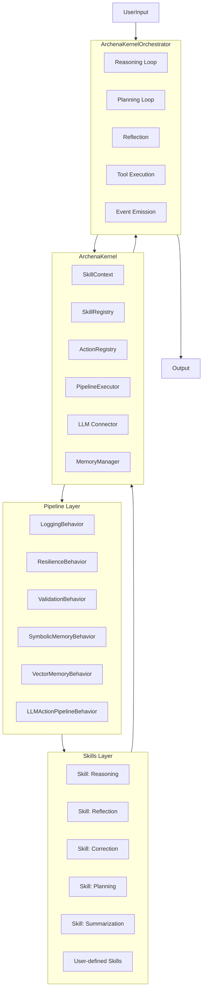
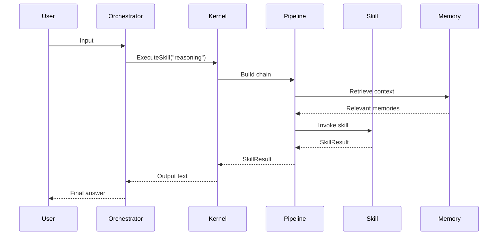
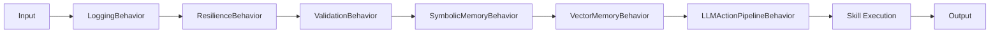
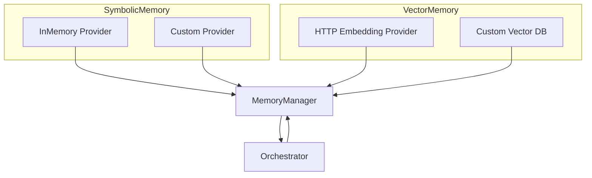
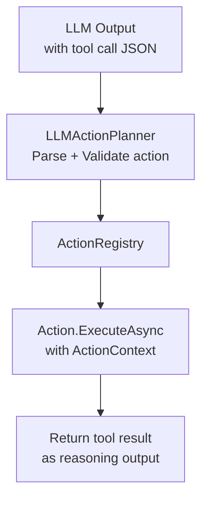
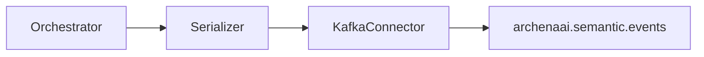

# 🧠 **ArchenaAI Semantic Kernel**

### *Deterministic, Pipeline-Driven, Skill-Based AI Orchestration Framework*

---

## ⭐ Overview

**ArchenaAI Semantic Kernel** is a modular, deterministic AI orchestration engine designed for:

* Multi-step reasoning
* Tool calling / Action execution
* Memory-augmented loops
* Semantic pipelines (Franz-style behaviors)
* Distributed eventing
* Agent architectures
* LLM + non-LLM hybrid reasoning
* Enterprise-grade reliability
* Kafka-based multi-agent messaging

It is the **foundational SDK** used by the upcoming
**ArchenaAI Runtime**, enabling distributed LLM agents to collaborate using structured messages, skills, tools, and reasoning pipelines.

---

# 📦 Features

### ✔ Skill system

Typed skills with descriptors, metadata, categories, automatic discovery, and deterministic execution.

### ✔ Pipeline execution engine

A Franz-inspired reversible pipeline chain enabling:

* Logging
* Resilience (retry, timeout, breaker)
* Validation
* Memory augmentation
* LLM Action / tool-calling interception

### ✔ Reasoning Orchestrator

Implements ReAct-style loops with:

* Reflection
* Correction
* Planning
* Tool execution
* Termination conditions
* Memory integration
* Semantic event broadcasting

### ✔ Memory stack

* Vector memory (via provider abstraction)
* Symbolic memory
* Unified memory manager
* Context-aware retrieval and injection into reasoning loops

### ✔ Action / Tool System

Strongly typed actions with:

* ActionDescriptor
* ActionContext
* ActionRegistry
* Automated execution from LLM responses

### ✔ Multi-agent ready

Kafka connectors + SemanticOrchestrator allow distributed reasoning across agent clusters.

---

# 🧱 Architecture Overview

Below are diagrams explaining the core architecture.

---

# **1. High-Level Kernel Architecture**



---

# **2. Skill Execution Flow**



---

# **3. Pipeline Behavior Chain**



The pipeline is **reversible**, meaning behaviors wrap the skill call like middleware:

```
Logging
  Resilience
    Validation
      SymbolicMemory
        VectorMemory
          ActionPlanner
             [Skill]
```

---

# **4. Memory Architecture**



---

# **5. Action / Tool Execution**



The kernel intercepts tool calls automatically from the LLM text output.

---

# **6. Distributed Semantic Event Bus**



Agents and external services can subscribe to this topic to observe:

* skill usage
* reasoning state
* meta-cognition
* memory updates
* tool invocations

---

# 🧬 Project Structure

```
ArchenaAI.Semantic.Kernel/
│
├── Skills/
│   ├── SkillAttribute.cs
│   ├── SkillDescriptor.cs
│   ├── SkillContext.cs
│   ├── SkillResult.cs
│   └── BuiltIns/
│
├── Pipelines/
│   ├── PipelineExecutor.cs
│   ├── KernelPipelineBehavior.cs
│   └── Behaviours/
│       ├── LoggingBehavior.cs
│       ├── ResilienceBehavior.cs
│       ├── ValidationBehavior.cs
│       ├── RetryBehavior.cs
│       ├── TimeoutBehavior.cs
│       ├── SymbolicMemoryBehavior.cs
│       └── VectorMemoryBehavior.cs
│
├── Actions/
│   ├── ActionRegistry.cs
│   ├── ActionDescriptor.cs
│   └── ActionContext.cs
│
├── Memory/
│   ├── IVectorMemoryProvider.cs
│   ├── ISymbolicMemoryProvider.cs
│   ├── MemoryManager.cs
│   └── Providers/
│
├── Connectors/
│   ├── LLM/
│   ├── Kafka/
│   └── HTTP/
│
├── Orchestration/
│   └── ArchenaKernelOrchestrator.cs
│
├── Messaging/
│   └── SemanticMessage.cs
│
├── ArchenaKernel.cs
├── IArchenaKernel.cs
└── Extensions/
    └── DependencyInjection Extensions
```

---

# 💻 Quick Start

## Install (when published to NuGet):

```bash
dotnet add package ArchenaAI.Semantic.Kernel
```

---

## 1. Register the kernel

```csharp
services.AddArchenaKernel(configuration);
```

---

## 2. Add skills

```csharp
[Skill("greet", Description = "Simple greeting skill", Category = SkillCategory.Local)]
public sealed class GreetingSkill : IArchenaSkill
{
    public SkillDescriptor Descriptor =>
        new("greet", "Greeting skill", SkillCategory.Local);

    public Task<SkillResult> ExecuteAsync(SkillContext context, CancellationToken ct)
    {
        var name = context.Input?.ToString() ?? "unknown";
        return Task.FromResult(SkillResult.FromSuccess($"Hello {name}!"));
    }
}
```

---

## 3. Run a skill

```csharp
var output = await kernel.ExecuteSkillAsync("greet", "Bernardo");
```

---

## 4. Run high-level reasoning

```csharp
var answer = await kernel.ThinkAsync("Explain microservices in simple terms.");
```

---

# 📌 Design Principles

### 🟩 Deterministic

Explicit skill metadata, typed outputs, validation.

### 🟩 Extensible

Every layer (skills, memory, pipelines, actions) supports custom implementations.

### 🟩 Distributed

Built-in Kafka for multi-agent communication.

### 🟩 Resilient

Retry, timeout, breaker, and validation behaviors.

### 🟩 Hybrid

Supports LLM + classical logic + external tools.

### 🟩 Agentic

Designed to support ArchenaAI Runtime for multi-agent systems.

---

# 🏁 Status

### ✔ **Kernel: 100% Complete**

### ✔ **Production-ready**

### ✔ **Runtime-ready**

### ⏳ Next step: **ArchenaAI Runtime (separate repository)**

---

# 🔮 Roadmap

* ArchenaAI.Runtime (agent host & supervisor)
* Multi-agent collaboration policies
* Agent federation layer
* Aegis security/governance integration
* Visual debugging environment
* MCP (Model Context Protocol) tool servers

---

# ❤️ License

MIT — Open, extensible, developer-friendly.


